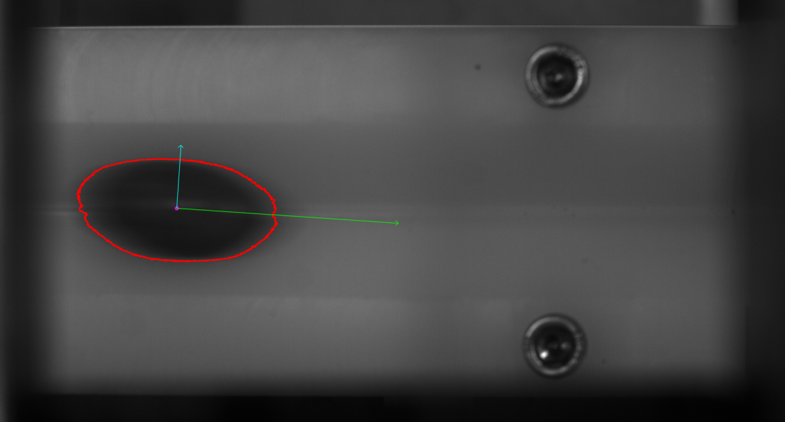

# real-time-shape-detection
Project goal: use GPU on ODROID-XU4 and OpenCL acceleration to achieve real time shape and orientation detection of fast moving objects.
Part of system for automatic segregation of seeds in an arboretum.


# Run code on Ubuntu using your webcam
First, please install OpenCV 2.4
```bash
sudo apt install libopencv-dev
```
Compile application:
```bash
cd PC/camera
make
```
Run the application using default camera (usually webcam).
```bash
./capture
```
You will see that in the video stream from camera the application finds an object, shows its bounding box and computes the orientation. Orientation direction is shown in form of arrows.

Example output of the algorithm running on ODROID-XU4 minicomputer with Basler acA2000-165um high-speed camera:



# OpenCL support on ODROID-XU4 with Ubuntu
Install https://developer.arm.com/technologies/compute-library

If the GL/gl.h is missing, install
```bash
sudo apt install mesa-common-dev
```

# OpenCL generic Ubuntu packages
Basic installation
```bash
sudo apt install ocl-icd-libopencl1
sudo apt install opencl-headers
sudo apt install clinfo
```
Compiling OpenCL code
```bash
sudo apt install ocl-icd-opencl-dev
```
In order to run OpenCL on Intel GT (IvyBridge and up)
```bash
sudo apt install beignet
```

# Information about OpenCL resources available on the machine
```bash
sudo apt install clinfo
clinfo
```

# Some bibliography suggestions:
http://www.sci.utah.edu/~gerig/CS7960-S2010/handouts/Hu.pdf

http://www.sciencedirect.com/science/article/pii/003132039090053N

http://ro.ecu.edu.au/cgi/viewcontent.cgi?article=7351&context=ecuworks

http://www.ingentaconnect.com/content/tcsae/tcsae/2016/00000032/00000004/art00006

#Odroid XU4 user manual
http://magazine.odroid.com/wp-content/uploads/odroid-xu4-user-manual.pdf

#Configuring OpenCL on Odroid:
http://granolamatt.com/working/2015/02/configure-opencl-on-odroid-xu3/
http://forum.odroid.com/viewtopic.php?f=95&t=5559

#OpenCL introduction:
http://www.drdobbs.com/parallel/a-gentle-introduction-to-opencl/231002854
https://people.maths.ox.ac.uk/gilesm/cuda/new_lectures/lec1.pdf
https://people.maths.ox.ac.uk/gilesm/cuda/new_lectures/lec2.pdf
